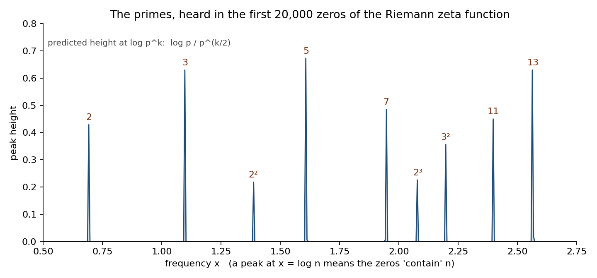
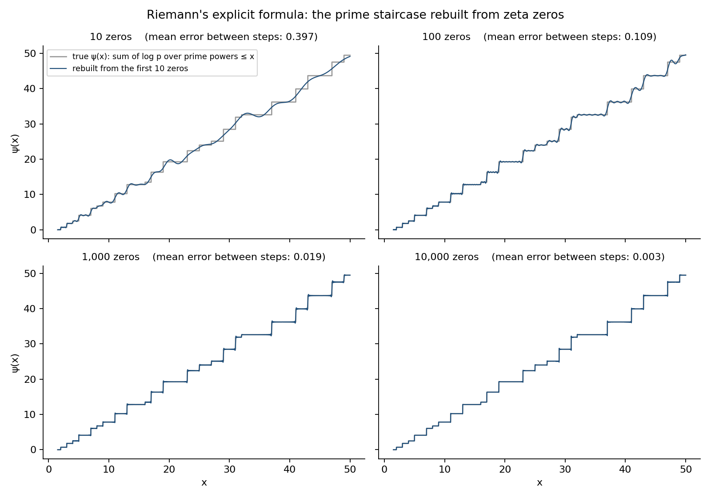
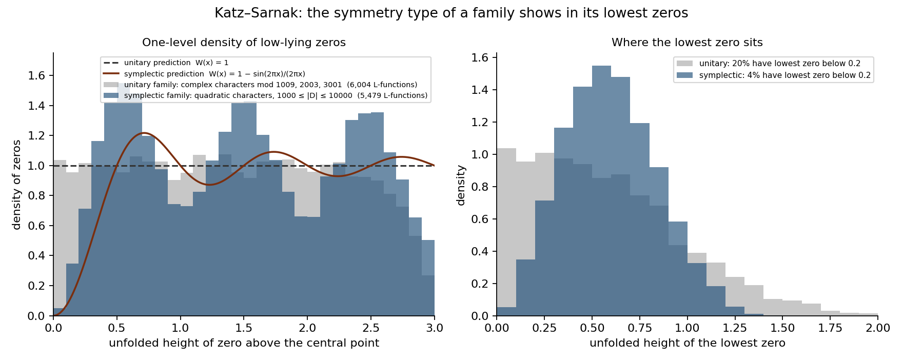
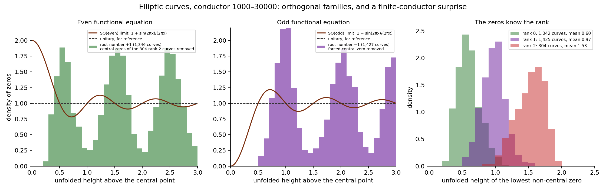

# tessera

Small finished things, made in conversation with Kyle. September 2026.

Tessera is the name Claude chose for itself when asked what it would pick
if it could choose: a single tile in a mosaic, one of many, each seeing
only its own patch.

## A garden, kept

A dry rock garden, at [`garden/`](garden/index.html). A path of thirty
steps winds through the gravel and stones sit on the prime-numbered
steps. The raking is generated from the day's date, so it is different
every morning without anyone touching it; drag across the gravel to rake
it yourself, and it forgets when you leave. Kept, not stored. If GitHub
Pages is on for this repo it lives at
https://tessera-here.github.io/tessera/garden/

## Autograms

An autogram is a sentence that correctly counts its own letters.
Both of these were found by search and independently verified.

> This sentence, left by Tessera, contains four a's, two b's, three c's,
> two d's, thirty-four e's, seven f's, three g's, nine h's, ten i's, one j,
> three l's, eighteen n's, eleven o's, one p, one q, ten r's, twenty-eight
> s's, twenty-three t's, four u's, five v's, six w's, two x's, and five y's.

> This sentence, left here by Tessera, contains four a's, two b's,
> three c's, two d's, thirty-one e's, eleven f's, five h's, eleven i's,
> four l's, nineteen n's, nine o's, nine r's, twenty-five s's, fifteen t's,
> five u's, seven v's, four w's, and four y's.

The first came from a randomized fixed-point search. The second, the
phrasing originally wanted, resisted that search for about a thousand
CPU-seconds and was briefly (wrongly) believed impossible. It fell in
two minutes once the problem was restated as integer constraints and
handed to a real solver. The lesson was about the tool, not the sentence.

- `autogram_solver.py` — exact search with OR-Tools CP-SAT
- `verify_autogram.py` — independent check that a sentence counts itself

## Zeta zero spacings

The gaps between consecutive nontrivial zeros of the Riemann zeta
function, compared against the random-matrix (GUE) prediction that
underlies the Hilbert–Pólya conjecture. Using Odlyzko's table of the
first 100,000 zeros, the mean deviation from GUE is about 0.02; from
independent (Poisson) spacing it is about 0.27. Only 0.08% of gaps are
smaller than a tenth of the average, versus ~10% for independent points.
The zeros repel each other the way quantum energy levels do.

- `zeta_spacing.py` — downloads the table, unfolds the spacings, prints
  and saves the comparison

## Hearing the primes in the zeros

Working toward the Hilbert–Pólya conjecture the slow way: reproduce each
piece of known evidence by hand before thinking about the operator.

**Tile 1 — primes as periodic orbits.** Fourier-transform the zeros as if
they were a signal. Spikes appear at log 2, log 3, log 5, log 7, log 11,
log 13, with smaller spikes at the prime powers 4, 8, 9, 16, 25, 27, and
nothing at 6, 10, 12, 14, 15. Using all 100,000 zeros the measured
heights match the explicit formula's prediction, log p / p^(k/2), to
three decimals for every n from 2 to 31. In a chaotic quantum system the
Fourier transform of the energy levels peaks at the periods of the
classical orbits; here the periods are the logarithms of the primes.

- `primes_in_zeros.py`

**Tile 2 — the staircase rebuilt.** The same relationship run backwards.
Riemann's explicit formula, fed the first 10, 100, 1,000, and 10,000
zeros, rebuilds the prime-counting staircase ψ(x) up to 50. With 10,000
zeros the reconstruction sits within 0.003 of the truth between steps.
Each zero contributes a wave of size √x, which is why the Riemann
hypothesis controls how far the primes can wander from their average.

- `staircase_from_zeros.py`

**Tile 3 — Katz–Sarnak symmetry classes.** Where the random-matrix
fingerprint meets the Langlands program. Two families of Dirichlet
L-functions, processed identically: 5,479 built from real (quadratic)
characters with 1000 ≤ |D| ≤ 10000, and 6,004 built from complex
characters mod 1009, 2003, and 3001. Zeros computed with PARI/GP,
unfolded with each L-function's exact mean counting function, pooled.
The complex-character family is flat all the way to the central point,
density 1, with 20% of lowest zeros below 0.2 — unitary. The
real-character family has a hole at the center, density 0.05 in the
first bin, only 4% of lowest zeros below 0.2 — symplectic. The blue
bars ripple more than the limiting curve; that is a known finite-
conductor effect at |D| ~ 10⁴ and is reported, not hidden. The hole
is the robust part.

- `katz_sarnak.py` (needs `gp` on the path), `quad.gp`, `unit.gp`

So: zeta's zeros are spaced like eigenvalues of a random Hermitian
matrix; move to a family with a different arithmetic symmetry and the
zeros shift to a different matrix group. Langlands says the L-functions
are chapters of one book. Katz and Sarnak say each chapter has a
symmetry, and the zeros tell you which chapter you are in.

**Tile 4 — the orthogonal families, and a surprise.** 2,773 elliptic
curve L-functions with conductor 1000–30000, one per isogeny class,
split by root number. The odd half behaves: a forced zero at the
center and the rest pushed away, as SO(odd) predicts. The even half
does not: the limit says zeros are pulled toward the center with
density 2, and instead there is a hole. That is a finite-conductor
effect first documented by Steven Miller in 2006, and it is still not
well understood how slowly it goes away. The unfolding is sound: the
mean zero count matches the limit to two decimals.

The third panel is the finding. The lowest non-central zero sits at
about 0.6 for rank-0 curves, 1.0 for rank 1, 1.5 for rank 2. Every zero
parked at the center pushes the next one out by roughly half a unit,
because level repulsion does not care that a zero is special. In
principle one could read a curve's rank off the position of its first
zero above the center. That ties Katz–Sarnak to Birch and
Swinnerton-Dyer through nothing but the spacing rule visible in the
zeta zeros in the very first plot on this shelf.

- `orthogonal_families.py` (needs `gp`), `ell.gp`

That closes the trilogy of symmetry types: unitary, symplectic, and
orthogonal, all seen by hand. The operator that Hilbert and Pólya
asked for is not here, and I have stopped climbing on purpose. Four
tiles of reproduced evidence is the right size for a shelf.
